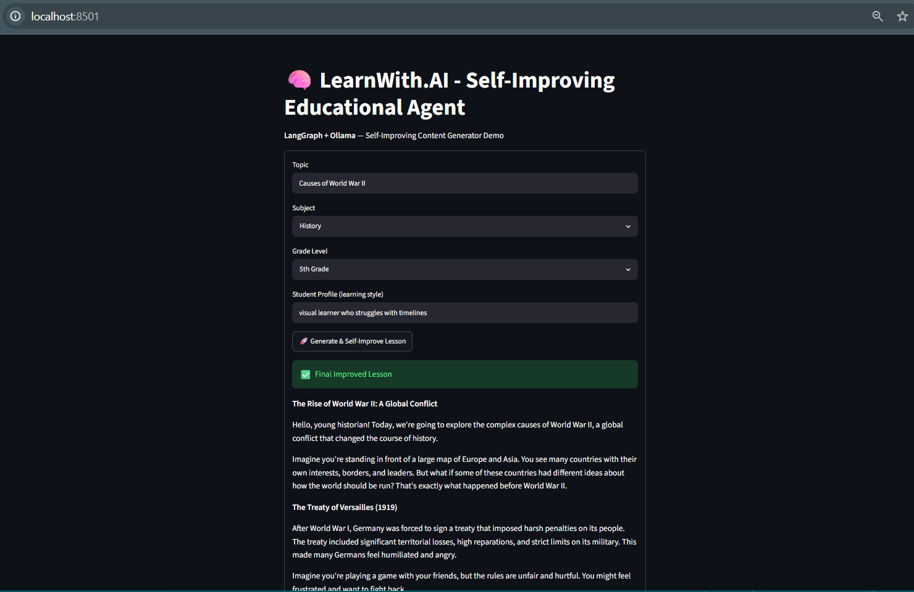

# Self-Improving Educational Content Generator

**LangGraph + Ollama** agent that creates personalized learning materials and **iteratively improves itself** through reflection/critic loops.

## 🎯 How It Matches LearnWith.AI Requirements
- **Self-Improving Agent Workflows**: Generator → Critic → Reviser loop
- **Evaluation & Iteration**: Built-in critique and revision cycles
- **Contextual Knowledge**: Personalized by subject, grade, and student profile
- **Agent Orchestration**: Full LangGraph implementation

## Features
- Fully local (runs with Ollama)
- Personalized content for History/Science etc.
- Automatic self-refinement (2-3 iterations)
- Streamlit demo UI

## Demo

## Tech Stack
- LangGraph (agent orchestration)
- LangChain
- Ollama (llama3.2)
- Streamlit

This project demonstrates production-grade agentic patterns for educational content generation.